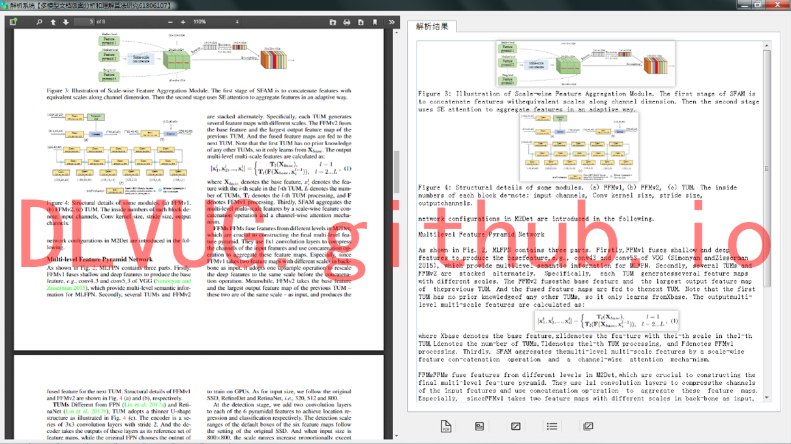
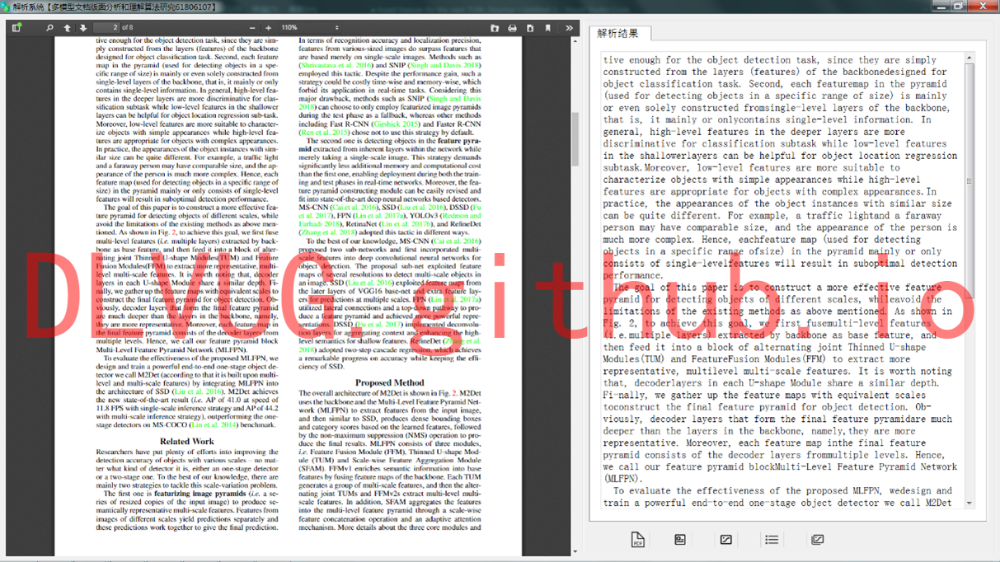
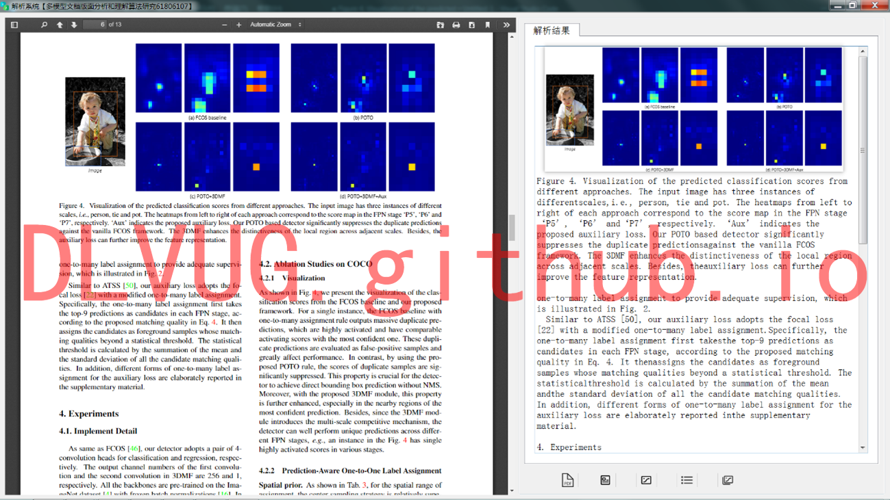

为满足移动阅读可读性需求，保证文档内容显示方式的重新调整，其关键在于获得原文档的物理逻辑结构和顺序信息。研究团队在已经有的算法和技术积淀下，研发了“PDF文档结构信息提取系统”。该系统能够提取结构化PDF文档中的文本、图片、图表、公式信息。系统功能定位分为四个部分：用户界面层，实现使用者与系统的交互功能；中间层实现为PDF内容抽取，其依赖于下一层“PDF文档解析”所提供的核心算法；另外还有校验部分主要针对程序可能出现的异常情况加以处理。通过解析原PDF文档，原本带格式的文本被研究团队研发的系统成功解析为文字编码，并且重新显示为无格式的文本，公式也以“图片格式”提取显示，有利于文本后续的编辑使用。

研究团队开发的“PDF文档结构信息提取系统”，成功提取了不同页面对象：文字、图片、表格、公式，等等。如下图所示：

