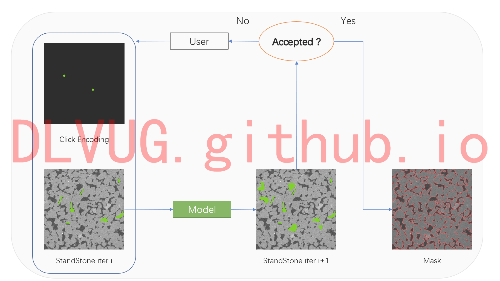
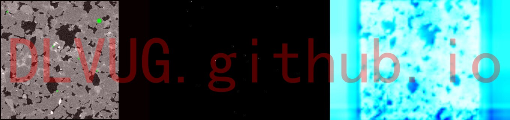
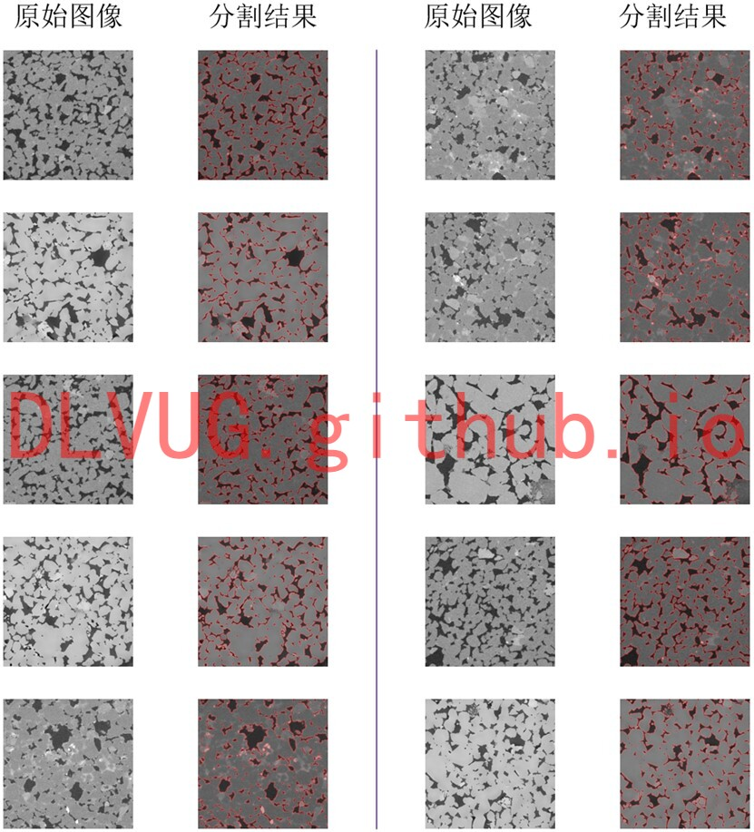

The user selects and interactively annotates a 2D image to generate a segmentation result, and can continue to correct it if the result is not satisfactory. This is an iterative process, during which the user can monitor and update the segmentation results anytime. The image segmentation of sandstone is obtained by combining a suitable deep-learning model with a human-computer interaction tool. The above diagram shows the flow chart of the whole HCI segmentation, and the following diagram visualizes the process of simulating clicks during the interaction segmentation.

用户选择并交互式地注释一个2D图像以生成一个分割结果，如果效果不理想则可以继续修正。这是一个迭代的过程，在此过程中用户可以随时进行监测和修正分割结果。通过合适的深度学习模型结合人机交互工具进而得到砂岩的图像分割。上图为整个人机交互分割的流程图，下图为在交互分割过程中的模拟点击的过程可视化。研究团队开发的“PDF文档结构信息提取系统”，成功提取了不同页面对象：文字、图片、表格、公式，等等。如下图所示：用户选择并交互式地注释一个2D图像以生成一个分割结果，如果效果不理想则可以继续修正。这是一个迭代的过程，在此过程中用户可以随时进行监测和修正分割结果。通过合适的深度学习模型结合人机交互工具进而得到砂岩的图像分割。上图为整个人机交互分割的流程图，下图为在交互分割过程中的模拟点击的过程可视化。

更多分割结果：

